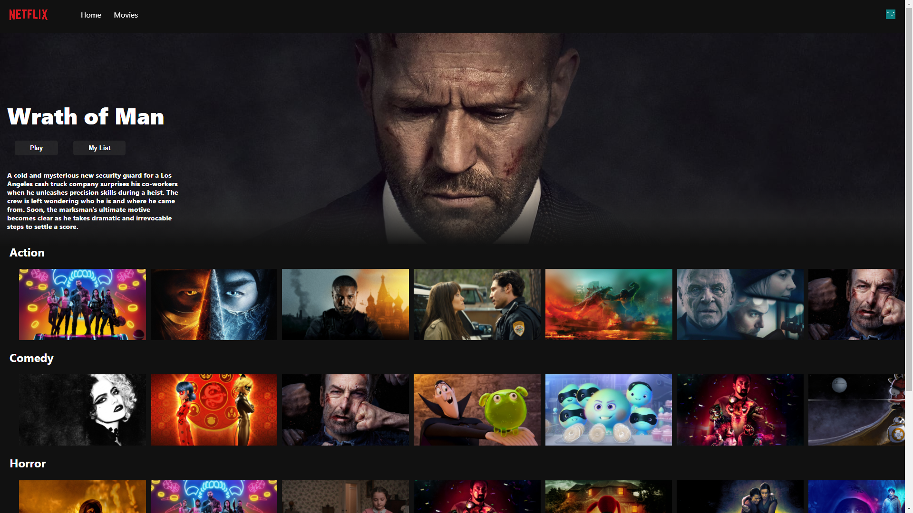

# NETFLIX CLONE

## What is This
>
> This is a netflix clone which i made with the help of react and TMDB
>
> 
>
> ---
>


>
> Note that before you start the project you need to go to the TMDB website and create a api key
>
> Then you need to enter the api key in the file src/Constants/constant.js in the variable 'API_KEY'
>
> ---
>
> This is a image of the Clone
>
>

## How To Use
>
> ### Clone The repository
> ```bash
> git clone https://github.com/AdithyanA2005/
> ```
>
> ### Install Dependencies
> ```
> npm install
> ```
>
> ### Start Developement server (This may take some time)
> ```bash
> npm start
> ```
>
> ---
>
> ### Open In Browser
> ```
> http://localhost:3000
> ```